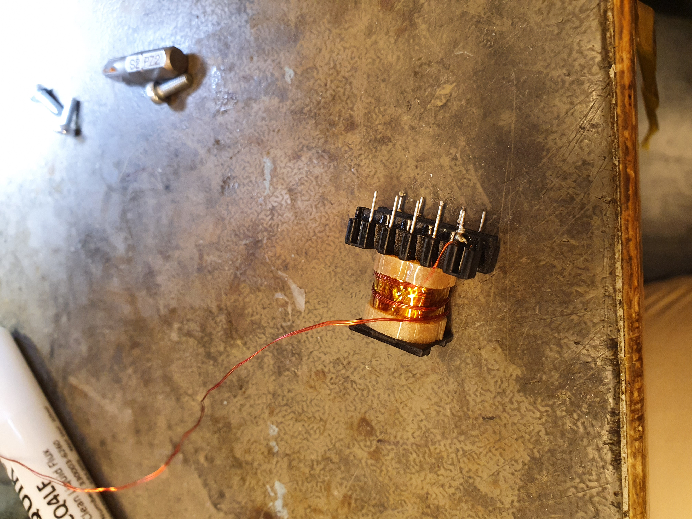

Auxiliary supplies
======================

Since the power supply is designed to be operated from the line voltage, we need to design a low power supply that powers the FPGA, measuremen circuitry and control circuitry. The power supply of choise for this is discontinuous mode flyback power supply. The flyback requires a minimum amount of parts, since only a transformer, controller and a diode and a capacitor is required for any additional voltage.

The regulated 5V supply line is obtained from an non-isolated power supply. The primary and secondary sides have own supplies. The lower voltage 3.3V is otained from the 5V with a linear supply.

DCM flyback design
------------------

Since dcm flyback is very common, there are a complete solutions available that does everything using just a single chip. The simplest chip for this that I have come accross is the family of of primary side feedback flyback controllers from Dialog Semiconductor. For this application, I chose IW1818 which allows for approximately a 10W flyback to be built. The IW1818 is a quasi resonant controller and the magic lies in that the feedback is taken from the primary side switched node.

The IW1818 has very good cross regulation. This was tested in a lab with 200mW and 5W loads at which the primary and secondary were measured between 15.3V and 14.6V with 15 V being the design goal.

Transformer design
------------------

The transformer design for low power DCM flyback is relatively simple. The transformer design is just copied from Fairchild Application Note AN4137.

The design is very simple, just add desired core characteristics and then iterate powers, the ripple factor to obtain a reasonable design where the windings are close enough for full turns. The design that I used has 52 turn primary, 8 turn secondaries and an off the shelf 250um gapped ee20 core of ef87 ferrite material. The coil formers and border tape are from aliexpress.

The structure of the transformer is visible in the picture talen during winding. There are 3mm border tapes on both sides of the transformer and the windings are built from 3 strands of awg34 wire. The wires are not twisted together sinve it is easier to wind in this way. Note that the ends are not sleeved even though this would be required for off line transformer thus new transformer needs tp be built with the ends pulled out of the winding inside proper extra isolation.

