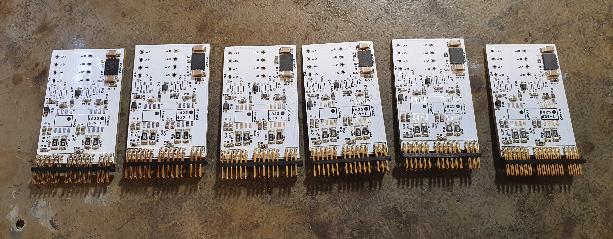
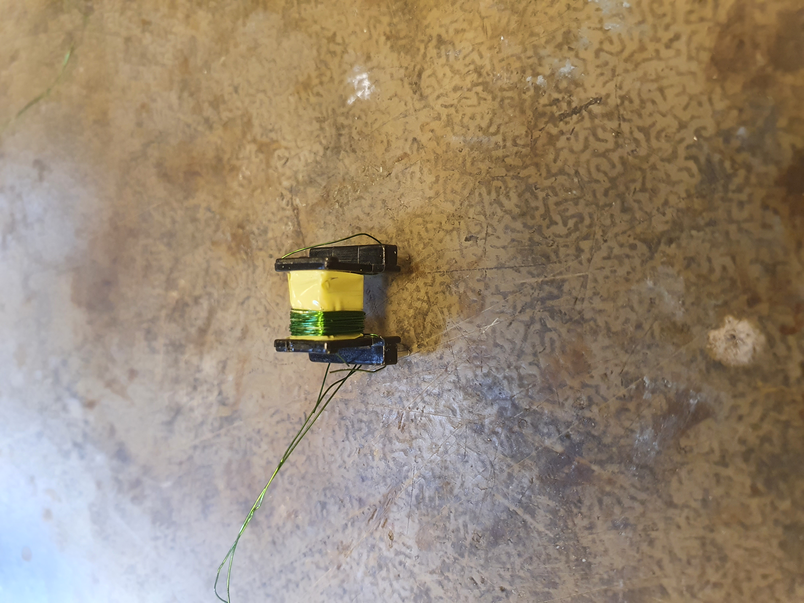

Gate drive power supply
=======================

The gate drivers also need to have a distinct power supplies. The main design goal of a gate drive power is that it is simple and small and provides voltages for the SiC gates. The accuracy for this does not need to be perfect, so anything between 14.5 and 16 V should be sufficient at this point. I have designed two versions of the gate drive power supply. One is build using a asymmetric flyback and the other is just basic flyback with a single transistor and rcd snubber. The gate drive power is operated open loop thus it is important that the supply has good open loop regulation. In my experience, the asymmetric flyback does this well enough. I have used an ixys IXDD609 gate driver as the power stage to drive the transformer. Since the secondaries are the same for both, the flyback and asymmetric flyback, I also ordered boards for the flyback.

The partially assembled boards are visible in the Figure below.

The gate power supplies have an EE10 transformers for each board and every board creates voltages for one half bridge. Additionally one of the pins is just the raw 15V voltage, which is used for powering the isolated ADC that is used to measure the inductor currents.

Gate power transformer design
-----------------------------

The transformer has 5 windings. 8 turn primary with 4 and 14 turn secondaries for the 15V and -4V voltages. The transformer design is pretty much based on just having a good enough unregulated voltages. From experience I know that a 8 turn primary will be sufficient to prevent in this configuration excessive core loss. However since the regulation of the voltages is dependent on the diodes, stray inductance and input voltages, all of which have some uncertainty the design is more or less trial and error with the hardware. I found that a satisfactory design was with primary wound as the first layer and then the secondaries are wound in two separate sections such that for one winding the 4 and 14 turn secondaries are on top of each other. This way the winding is quite symmetric and that should result in good enough cross regulation. The increased stray inductance also is useful for reducing inrush current.

The transformer before final taping is shown below. The two pairs of secondaries are wound in similar fashion side by side and a layer of tape is placed between them

