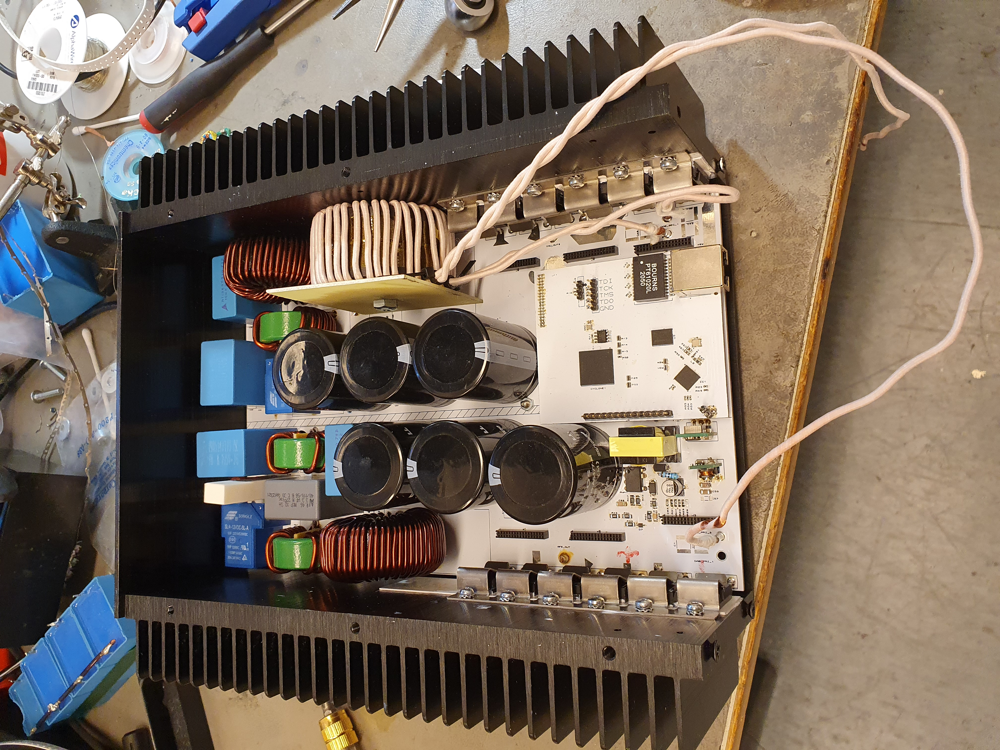

Welcome to bidirectional power supply build documentation pages!
================================================================

These are documentation pages and build log for fully FPGA controlled bidrectional power supply. The code can be found in github at 

https://github.com/johonkanen/ac_in_ac_out_lab_power_supply

The VHDL code for this project is built using hVHDL libraries. The hVHDL libraries and high level methods allow the code to be written at high level and the methods allow for very fast development and continuously improvement and reuse of existing code. The hVHDL project is open source and can be found in Github

https://github.com/hVHDL

I have written about the design methods and some of the math behind this power supply at my home page https://hardwaredescriptions.com

.. toctree::
    :caption: About
    :hidden:

    about/continuous_integration.rst
    about/module_repository_structure.rst

.. toctree::
    :caption: Why FPGA/VHDL for power electronics
    :hidden:

    fpga_for_power_electronics_control/test_driven_development_for_io.rst

.. toctree::
    :caption: Auxiliary supplies
    :hidden:

    auxiliary_supplies/dcm_flyback_auxiliary_supply.rst
    auxiliary_supplies/gate_drive_power_supply/gate_drive_power_supply.rst

.. toctree::
    :caption: Control hardware
    :hidden:

    FPGA_control_card/control_card.rst
